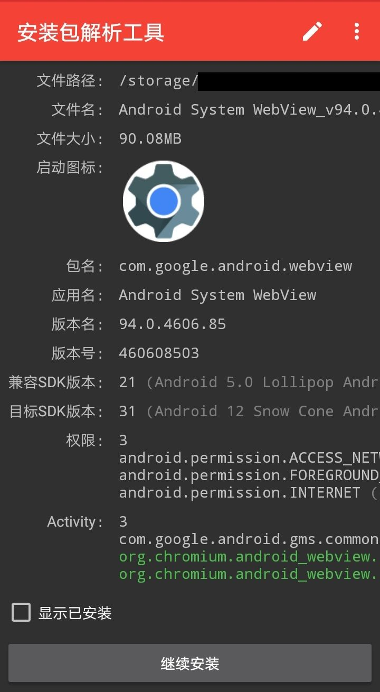

# ApkChecker
原应用由[By_syk](https://github.com/by-syk)开发，此项目仅进行了外围修改，使Android SDK 24-33显示对应的安卓版本。
## Build
使用[Apktool](https://apktool.org/docs/install/)，在项目根目录下运行
```
apktool b .\ApkChecker
```
可在 .\\ApkChecker\\dist 目录下得到未签名的apk文件。
然后在该目录下使用JDK提供的签名工具将其签名后即可安装使用。
```
keytool -genkey -alias key.keystore -keyalg RSA -validity 30000 -keystore key.keystore
jarsigner -verbose -keystore key.keystore -signedjar apkchecker-signed.apk apkchecker.apk key.keystore
```
## Develop
首先获取原版安装包，使用[Apktool](https://apktool.org/docs/install/)，运行
```
apktool d ApkChecker.apk
```
获得反编译后的文件。此项目只修改了 ApkChecker\\smali\\com\\by\_syk\\apkchecker\\a\\g.smali，您可以参照格式自行修改。
## Preview
